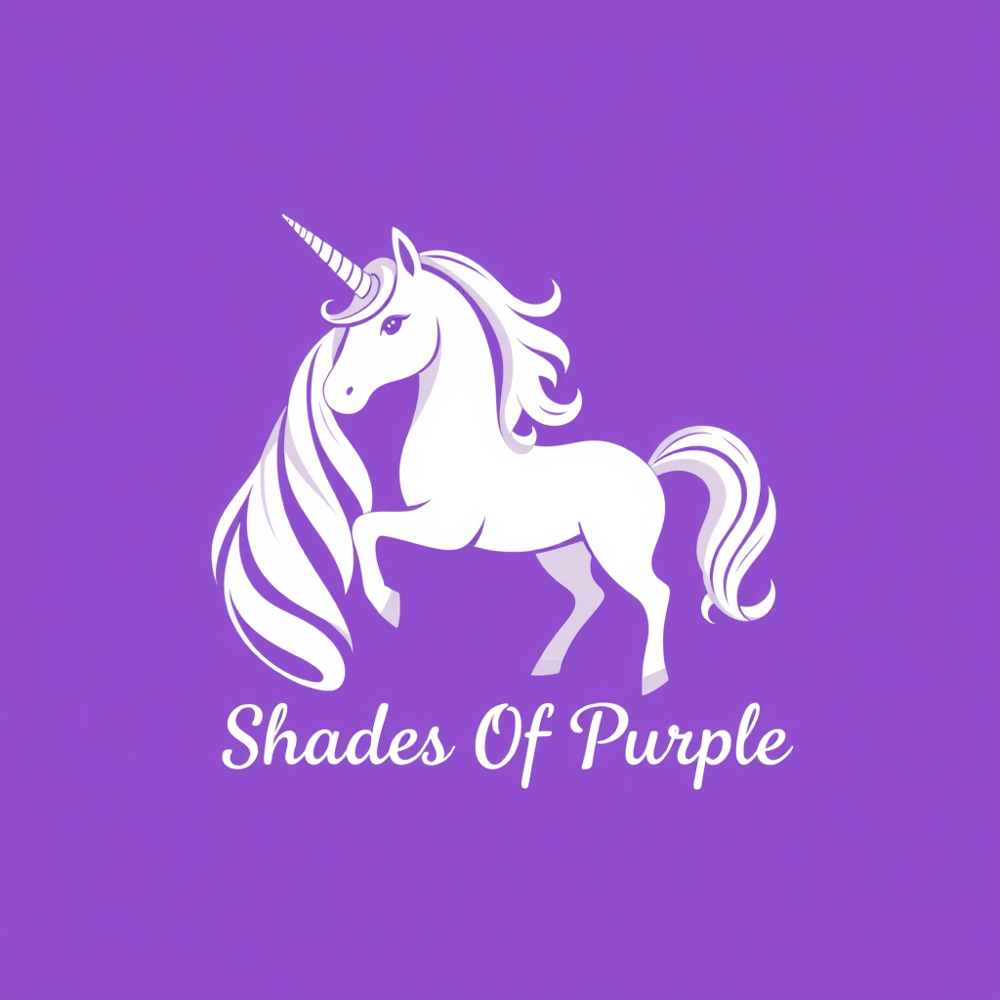

## 🦄 Shades Of Purple

Shades of Purple offers a hand-picked selection of bold and vibrant shades of purple that will transform your code into a visually stunning masterpiece. With its carefully crafted color palette, this theme brings a sense of style, elegance, and whimsy to your favorite code editor, making your coding sessions a delightful journey of creativity. 

## Contribute

That said, there's a bunch of ways you can contribute to this project, like by:

* ⭐ Giving a star on this repository (this is very important and costs nothing)
* 🪲 Reporting a bug
* 📄 Improving this documentation
* 🚨 Sharing this project and recommending it to your friends
* ✏️ Or you can contribute code by following this <a href="./docs/CONTRIBUTING.md">guide.</a>

## Contributors

This project exists thanks to all the people who contribute.

## License

<!-- License -->
  