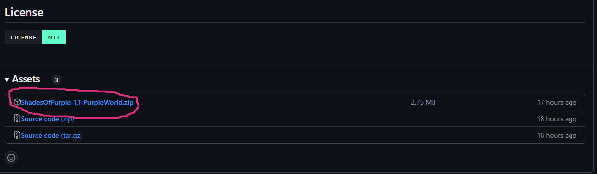

## 🦄 Shades Of Purple


Shades of Purple offers a hand-picked selection of bold and vibrant shades of purple that will transform your code into a visually stunning masterpiece. With its carefully crafted color palette, this theme brings a sense of style, elegance, and whimsy to your favorite code editor, making your coding sessions a delightful journey of creativity. All credits to <a href="https://github.com/ahmadawais">Ahmad Awais</a> official creator of the theme that was originally created for vscode, I just made the version for the jetbrains ide's. 

## Theme preview

Normal Shades of purple


Shades of purple dark


Shades Of Dracula


Shades Pastel Dark


## Install

To install it is very simple, while jetbrains reviews my theme you can install it by following these steps:

* First, go to relases and then look for the last file of the latest version:



* Download the file in the place circled in purple for the latest version of the theme.


* In intellij or in your preferred jetbrains ide, in the upper right corner, click on the gear.


* After clicking on the gear, click on plugins.


* In plugins, click on the other gear, in the upper right field. Then click on install plugin from disk


* Then open this file manager, go to the path where the zipped file is and select it. Then click ok.


* After clicking ok, this screen will appear, and you click on restart the ide.


* After restarting the IDE, just go back to the first gear in the top right corner and select the themes fieldand select your preferred theme.

## Contribute

That said, there's a bunch of ways you can contribute to this project, like by:

* ⭐ Giving a star on this repository (this is very important and costs nothing)
* 🪲 Reporting a bug
* 📄 Improving this documentation
* 🚨 Sharing this project and recommending it to your friends

## Compatibility

This theme is compatible with the following IDE's:

```
Android Studio — Iguana | 2023.2.1 Canary 8 — Ladybug | 2024.2.1 Canary 8
AppCode — build 232.0 — 242.*
Aqua — 2024.1.1 — 2024.2
CLion — 2023.2 — 2024.2.0.1
Code With Me Guest — build 232.0 — 242.*
DataGrip — 2023.2 — 2024.2.1
DataSpell — 2023.2 — 2024.2.1
GoLand — 2023.2 — 2024.2.0.1
IntelliJ IDEA Community — 2023.2 — 2024.2.1
IntelliJ IDEA Ultimate — 2023.2 — 2024.2.1
JetBrains Client — build 232.0 — 242.*
JetBrains Gateway — 2023.2 — 2024.2
MPS — 2023.2 — 2024.1
PhpStorm — 2023.2 — 2024.2.1
PyCharm Community — 2023.2 — 2024.2.1
PyCharm Professional — 2023.2 — 2024.2.1
Rider — 2023.2 — 2024.2.2
RubyMine — 2023.2 — 2024.2.1
RustRover — 2024.1 — 2024.2
WebStorm — 2023.2 — 2024.2.1
Writerside — 2024.1
```

## License

  <a href="LICENSE" target="_blank" rel="noopener noreferrer">
    
  </a>
